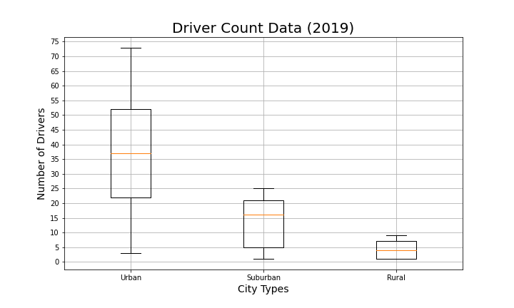

# PyBer_Analysis

# Overview PyBer analysis:

Pyber requested an analysis, of their provided Ride Share Data, by city type to find how it differs. Provide them with a completed report and data visualization that could be used by decision-makers at PyBer for future changes to their business model. 

# Results:

This scatter chart shows the Average Fare ($) in relation to the Total Numbers of Rides.
The Urban City Types have more Total Numbers of Rides versus the Rural City Types. 

This box chart shows the Number of Rides in relation to the City Types.
The Urban City Types have more Numbers of Rides versus the Rural City Types. 

This box chart shows the Average Fare ($) in relation to the City Types.
The Rural City Types have higher Average Fares that the other City Types. 
Probably due to the greater distance traveled.

This box chart shows the Number of Drivers in relation to the City Types.
The Urban City Types have more Numbers of Drivers versus the Rural City Types. 

This chart shows the fare total by City Type during January 1, 2019 to April 29, 2019.
The Urban City Types have the highest fares. 

# Summary:

I would make the following recommendation for the Rural City market adding less than 5 more drivers to this area. 

I would make the following recommendation for the Suburban City market maintaining the number of drivers in this area. 

I would make the following recommendation for the Urban City market adding multiple more drivers to this area. 

